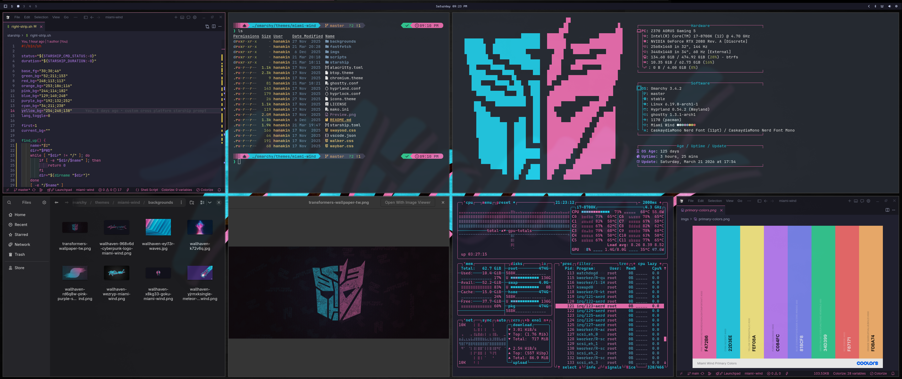
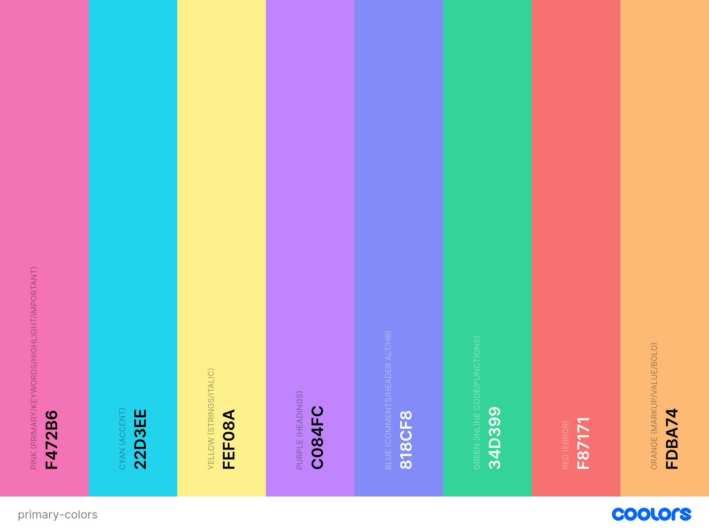
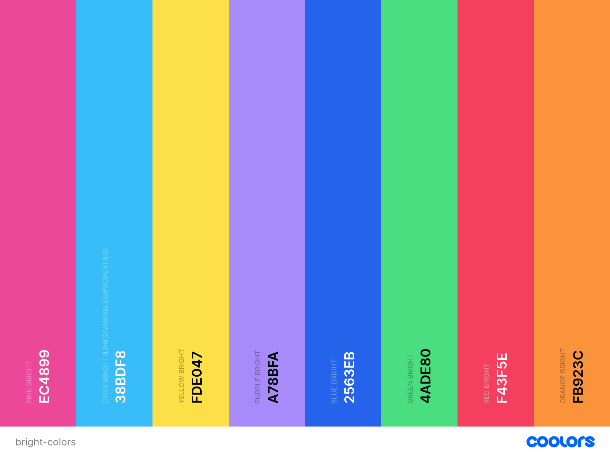
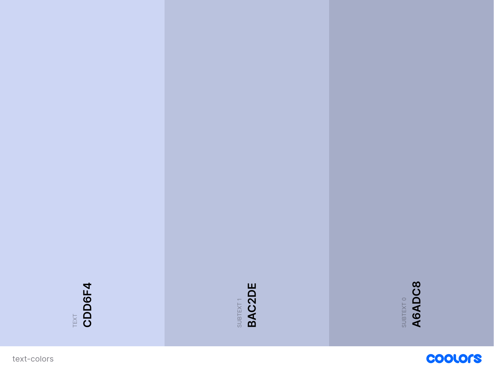
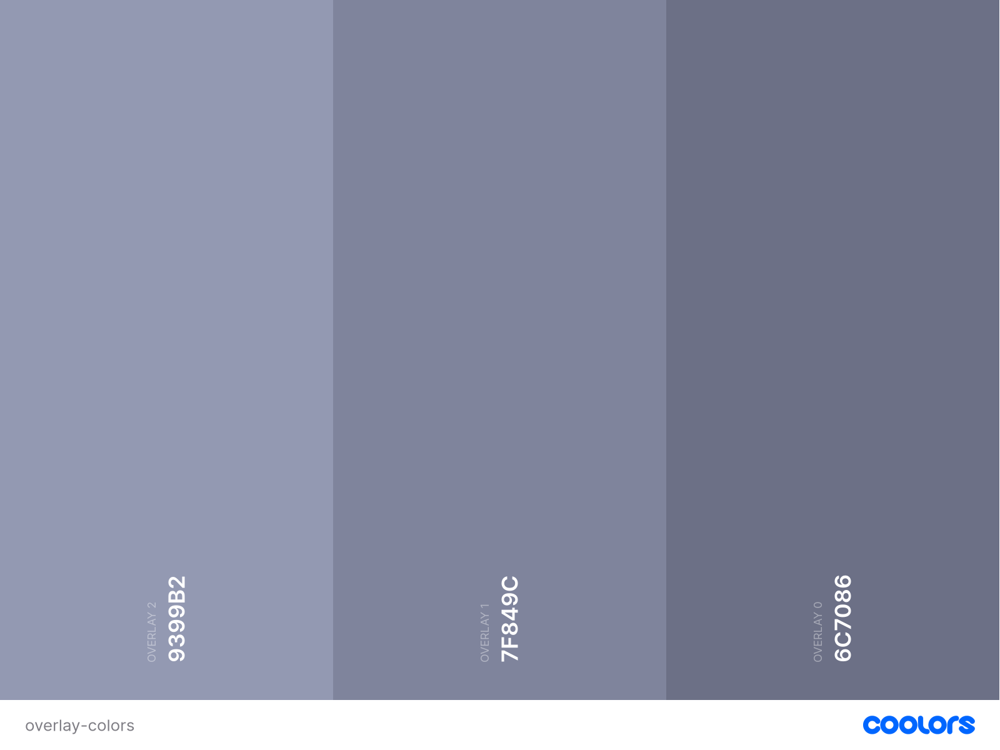
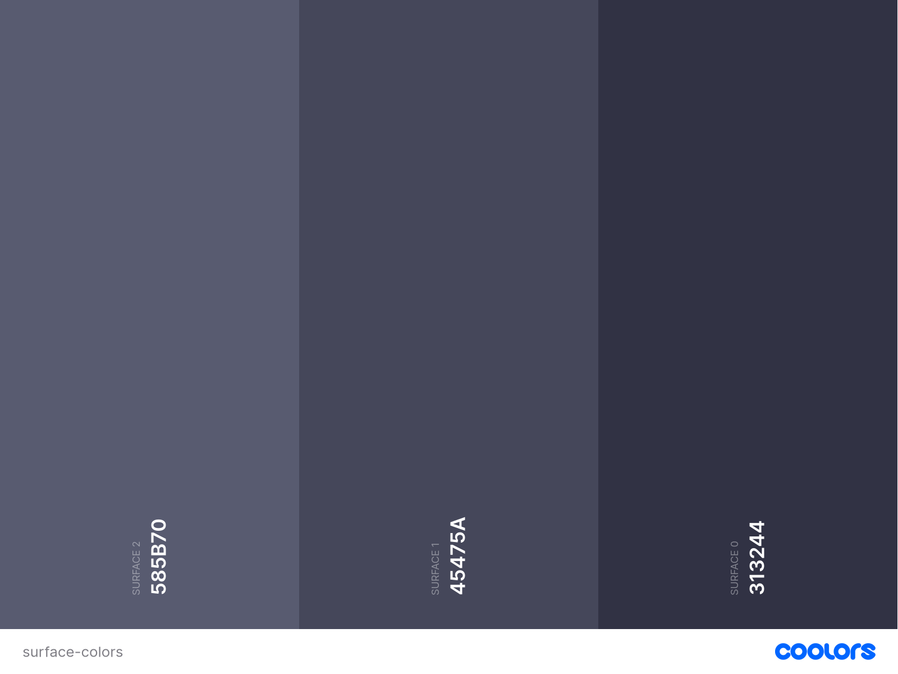
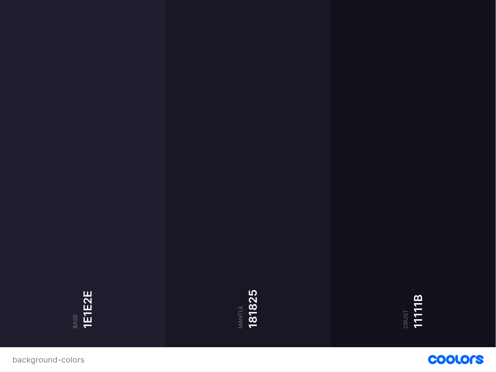

# Miami Wind Omarchy Theme
An Omarchy theme based on Miami Wind color scheme which is a blend of colors from [Tailwind CSS](https://tailwindcss.com/docs/colors) and Greyscale colors from [Catppuccin Mocha](https://catppuccin.com/) with inspiration from the theme [Miami Nights](https://github.com/monkeytypegame/monkeytype/blob/master/frontend/static/themes/miami_nights.css) for [Monkeytype](https://www.monkeytype.com). Color Swatches built using [Coolors](https://coolors.co/)

## Preview

## Color Palette

## Base Colors
[Primary Colors](https://coolors.co/f472b6-22d3ee-fef08a-c084fc-818cf8-34d399-f87171-fdba74)

## Additional Colors
[Bright Colors](https://coolors.co/palette/ec4899-38bdf8-fde047-a78bfa-2563eb-4ade80-f43f5e-fb923c)

## Greyscale

[Text Colors](https://coolors.co/cdd6f4-bac2de-a6adc8)

[Overlay Colors](https://coolors.co/9399b2-7f849c-6c7086)

[Surface Colors](https://coolors.co/585b70-45475a-313244)

[Background Colors](https://coolors.co/1e1e2e-181825-11111b)

