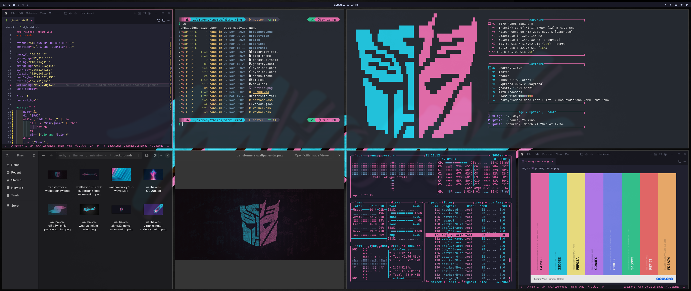
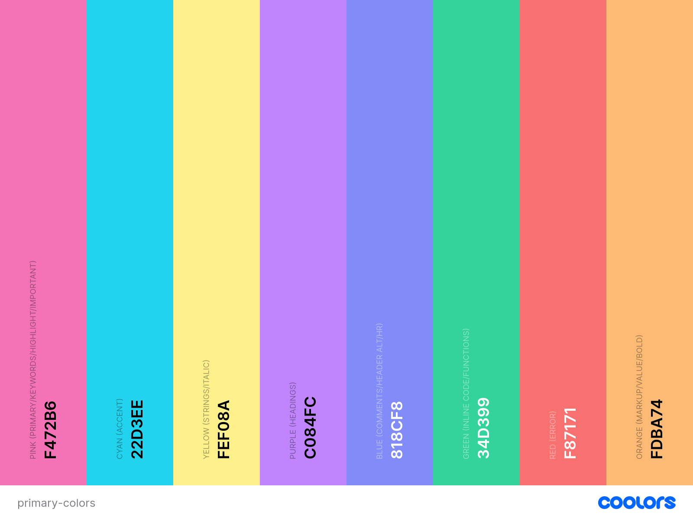
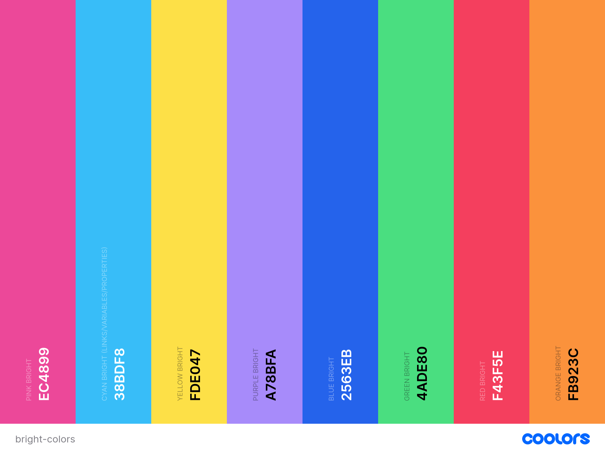
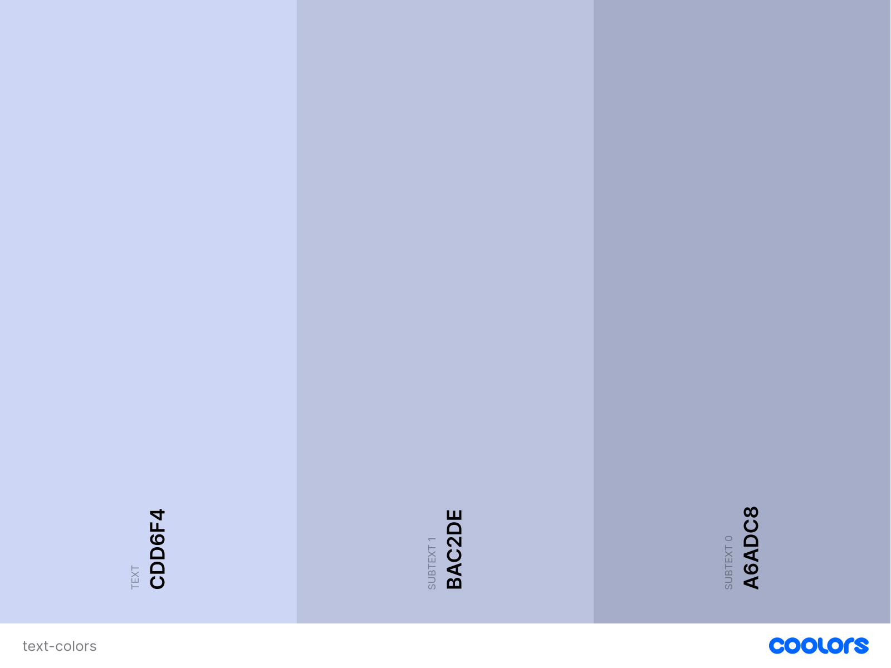
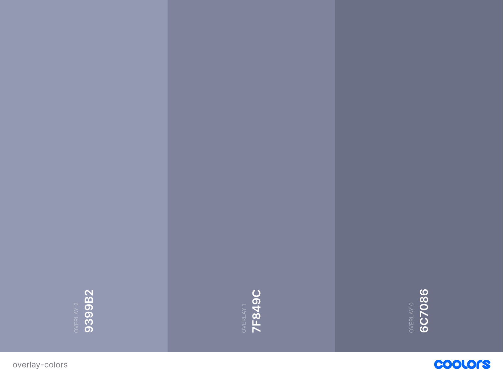
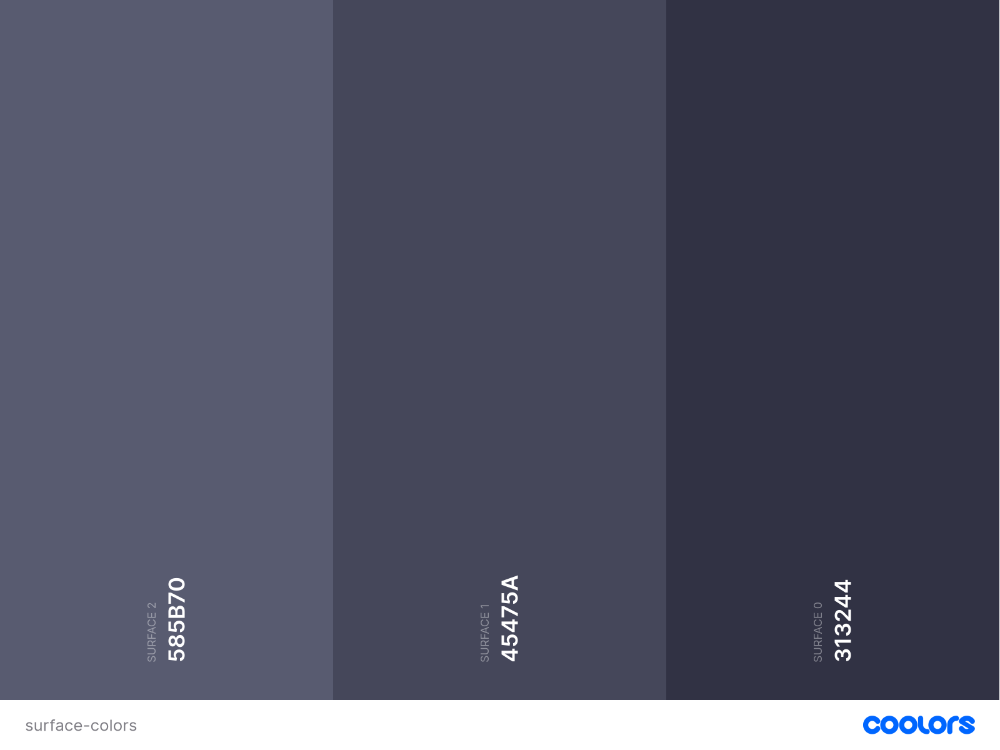
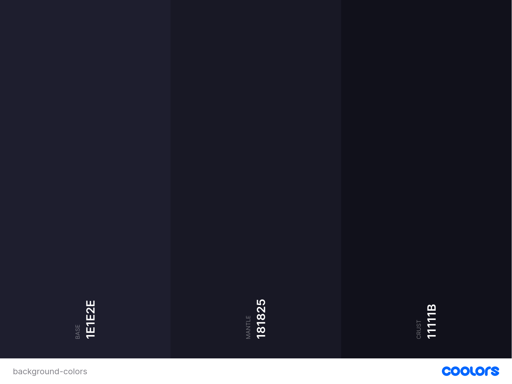

# Miami Wind Omarchy Theme
An Omarchy theme based on Miami Wind color scheme which is a blend of colors from [Tailwind CSS](https://tailwindcss.com/docs/colors) and Greyscale colors from [Catppuccin Mocha](https://catppuccin.com/) with inspiration from the theme [Miami Nights](https://github.com/monkeytypegame/monkeytype/blob/master/frontend/static/themes/miami_nights.css) for [Monkeytype](https://www.monkeytype.com). Color Swatches built using [Coolors](https://coolors.co/)

## Installation on current Omarchy

For the full theme, clone your trusted working copy and run the installer:

```bash
git clone https://github.com/hanakin/omarchy-miami-wind-theme.git ~/Work/omarchy-miami-wind-theme
cd ~/Work/omarchy-miami-wind-theme
bash scripts/install.sh
```

The installer links the theme to this working copy and applies Miami Wind. It also installs the Starship prompt, Fastfetch configuration and logo, and an About launcher that measures the complete custom layout before sizing its window. The About menu entry retains its icon and label. Existing configurations are backed up under `~/.local/state/omarchy/backups/`.

Flatery Pink Dark icons are downloaded from [cbrnix/Flatery](https://github.com/cbrnix/Flatery), including both base directories required by their relative links. The icon setting is `Flatery-Pink-Dark`. Use `--skip-icons` if these icons are already installed or you need an offline install. Use `--no-apply` to install files without switching themes. Reopen the file manager after installation.

This is an explicit trusted local install: Omarchy's normal Git theme installer filters terminal configs, Lua and editor extension descriptors. The local working-copy link allows the supplied files to be staged without changing Omarchy itself. The VS Code descriptor requests the `hanakin.miami-wind` extension. Keep the working copy in place; after pulling future updates, rerun `bash scripts/install.sh`.

`colors.toml` supplies the palette to current Omarchy components, `hyprland.lua` preserves the original pink active borders, and Ghostty includes the palette alongside its font settings. Starship helpers use the current `~/.local/state/omarchy/current/theme/` path. The legacy `hyprland.conf` remains for older installations.

The repository does not contain a GTK stylesheet. The file manager uses Omarchy's dark GTK appearance with Flatery icons. Display layout, scaling and idle timeouts are machine preferences and are not changed by this theme.

For only the standard filtered theme installation:

```bash
omarchy theme install https://github.com/hanakin/omarchy-miami-wind-theme
```

That command does not install the custom About sizing, prompt or Flatery dependency. For those features, use the trusted local installer above (it can also be run from inside the clone created by `omarchy theme install`).

## Preview



## Color Palette

## Base Colors
[Primary Colors](https://coolors.co/f472b6-22d3ee-fef08a-c084fc-818cf8-34d399-f87171-fdba74)



## Additional Colors
[Bright Colors](https://coolors.co/palette/ec4899-38bdf8-fde047-a78bfa-2563eb-4ade80-f43f5e-fb923c)



## Greyscale

[Text Colors](https://coolors.co/cdd6f4-bac2de-a6adc8)



[Overlay Colors](https://coolors.co/9399b2-7f849c-6c7086)



[Surface Colors](https://coolors.co/585b70-45475a-313244)



[Background Colors](https://coolors.co/1e1e2e-181825-11111b)

